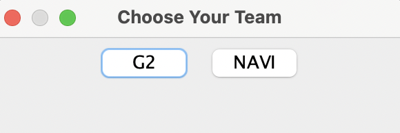
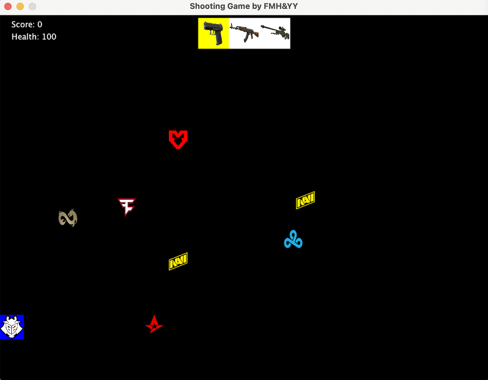

# Shooting Game
## Developers: Cyber Shooting Team
## Minghan Fan (mfan@macalester.edu), Yu Yan (yyan@macalester.edu)

### Description
Shooting Game is a single-player action-packed game where the player navigates a character who must shoot enemies approaching from all directions, and keep tracking the movement of the player. The player can use the WASD(W-moves up, A-moves left, S-moves down, D-moves right) keys to control the character and the arrow keys on the keyboard to shoot in four directions(left arrow-shoot left, right arrow-shooting right, up arrow- shooting bullets upwards, down arrow-shooting bullets downwards). First, the player chooses the team that the character represents. They can choose the character from team “G2” or team “Navi”. In the game, different labels represent enemies from various teams by noting the unique symbols and colors of each enemy icon. The team names and enemy icons are referencing esports organizations which participate in a game called CounterStrike’s professional matches.  The game progresses through various difficulty levels, with easier levels featuring fewer, slower enemies and more challenging levels increasing the number and speed of enemies. 

### Key Features
- **Health System**: Player starts with a set amount of health, which decreases if an enemy attacks the player(touches the player). The game ends if health reaches zero.

- **Scoring System**: Player earn points by defeating enemies. Accumulating a target score results in a victory, allowing players to advance or end the game.

- **Weapons**: The game includes a variety of weapons, each offering different damage levels and shooting speed. 

- **2D Map**: The game features a simplified 2D map, adhering to project constraints by avoiding a 3D implementation.

### Software Requirements
- **Java Version**: Java 7 or later

- **Github Desktop**

- **IDE(recommend Visual studio code)**

### Software Requirements
- **Compatibility**: Currently, the game is only tested on MacOS and may not function correctly on other operating systems such as Windows

### Resources
This game was developed using resources from the following:
[Counter-Strike Official Website](https://www.counter-strike.net/) for inspiration on game mechanics, weapon, team name and enemy icons. 

### Screenshots of Mainwindow

### Demo Video

